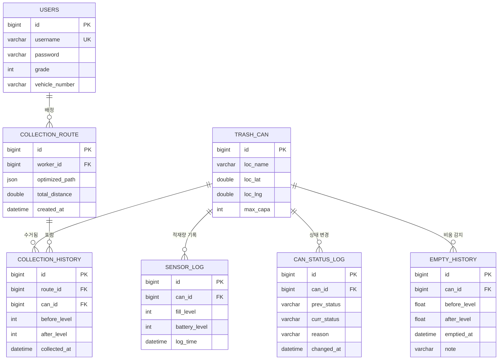
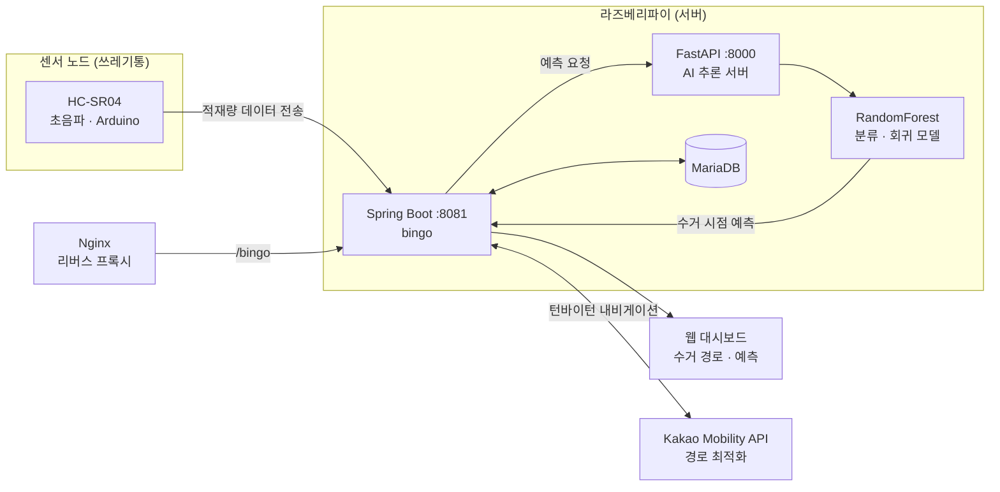
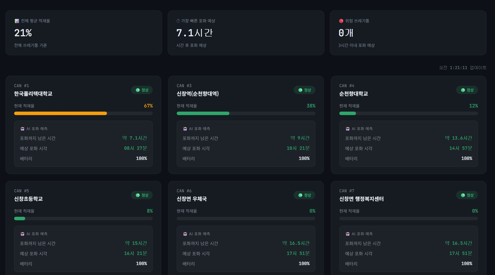
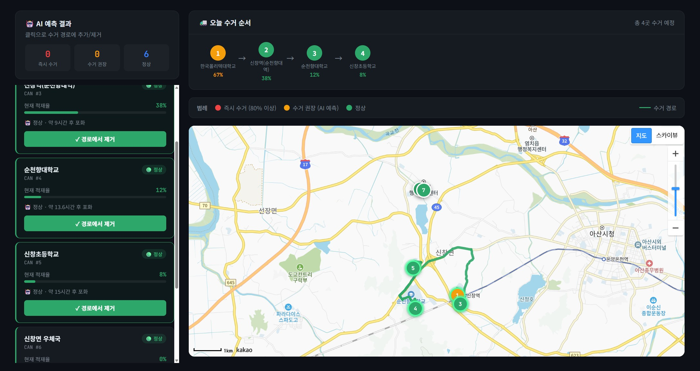

# EcoLink BinGo

IoT 센서 기반 스마트 쓰레기통 적재량 모니터링 및 수거 경로 최적화 시스템

초음파 센서로 쓰레기통 적재량을 실시간 수집하고, AI 모델로 만적 시점을 예측하여 수거가 필요한 쓰레기통만 최적 경로로 수거하도록 돕는 웹 서비스입니다.

| 항목 | 내용 |
|---|---|
| 개발 기간 | 2026.03 ~ |
| 개발 인원 | 4명 |
| 담당 역할 | **백엔드 개발** (Spring Boot REST API, JPA 엔티티 설계, DB 스키마 설계, 서버 DB 연동) |
| 배포 | Raspberry Pi 홈서버 + Nginx 리버스 프록시 |

<br>

## 기술 스택

### 담당 영역

| 분류 | 기술 |
|---|---|
| Language | Java 17 |
| Framework | Spring Boot 3.5, Spring Web, Spring Data JPA (Hibernate) |
| Database | MySQL / MariaDB, SQL (DDL · DML) |
| Build | Gradle |
| Library | Lombok |
| Test | JUnit 5, H2 (테스트용 인메모리 DB) |
| Tool | Postman, Docker, Git / GitHub, Eclipse (STS) |

### 프로젝트 전체

| 분류 | 기술 |
|---|---|
| Backend | Spring Boot, FastAPI |
| AI | Python, scikit-learn (RandomForest Classifier / Regressor) |
| Frontend | HTML, CSS, JavaScript, Chart.js, Kakao Map API |
| IoT | Arduino, HC-SR04 초음파 센서, Raspberry Pi |
| Infra | Nginx, systemd, Raspberry Pi |
| External API | Kakao Mobility API (경로 최적화) |

<br>

## 담당 업무

### 1. 백엔드 계층 구조 설계 및 구현
- Controller · Service · Repository로 역할을 분리한 **레이어드 아키텍처**로 백엔드 기본 구조를 설계했습니다.
- 쓰레기통, 센서 로그, 상태 변경 로그, 수거 경로, 수거 이력, 작업자 등 **6개 도메인의 엔티티 · 리포지터리 · 서비스 · 컨트롤러**를 작성했습니다.

### 2. JPA 엔티티 및 연관관계 매핑
- `@ManyToOne(fetch = LAZY)` + `@JoinColumn`으로 외래키 관계를 매핑하고, `@OneToMany(mappedBy)`로 양방향 연관관계를 구성했습니다.
- 양방향 관계를 JSON으로 직렬화할 때 발생하는 **순환 참조 문제를 `@JsonIgnore`로 해결**했습니다.
- 엔티티에 Setter를 두지 않고 생성자와 `update()` 메서드로만 값을 변경하도록 하여 **객체 상태 변경 지점을 제한**했습니다.

### 3. DB 스키마 설계
- 7개 테이블의 스키마와 외래키 관계를 설계하고, 테이블 생성 · 테스트 데이터 삽입 · 수정 · 삭제 SQL 스크립트를 작성했습니다.
- 로컬 개발용 테스트 SQL을 분리하여 로컬 DB와 배포 서버 DB 환경을 구분해 테스트했습니다.

### 4. REST API 개발
- 작업자 **회원가입 및 CRUD API**를 구현했습니다. 요청 데이터는 DTO(`SignUpRequest`)로 받아 엔티티와 분리했습니다.
- 쓰레기통 · 센서 로그 · 상태 로그 · 수거 경로 · 수거 이력 조회 API와 센서 데이터 수신 API를 구현했습니다.
- 프론트엔드에서 API를 호출할 수 있도록 **CORS 설정**(`WebMvcConfigurer`)을 추가했습니다.
- 모든 API는 Postman으로 요청 · 응답을 검증했습니다.
- 연관 엔티티를 그대로 직렬화할 때 발생한 **지연 로딩 프록시 직렬화 오류(500)**를 연관 엔티티는 `@JsonIgnore`로 숨기고 ID만 노출하는 방식으로 해결했습니다.

### 5. 배포 서버 DB 연동
- 도메인 서버의 DB와 Spring Boot 애플리케이션을 연동하고, 데이터 삽입 · 삭제를 테스트했습니다.

### 6. 리팩터링 및 테스트
- **응답 DTO 분리** : 작업자 조회 API가 엔티티를 그대로 반환해 비밀번호가 응답에 노출되던 문제를 `WorkerResponse` DTO로 분리해 해결했습니다.
- **예외 처리 통일** : `RuntimeException`으로 인해 500으로 응답하던 조회 실패를 커스텀 예외(`NotFoundException`)와 `@RestControllerAdvice`로 처리해 **404와 에러 메시지**를 반환하도록 개선했습니다.
- **수정 API 버그 수정** : 비밀번호를 비우고 작업자 정보를 수정하면 `null`이 저장되어 오류가 나던 문제를, 빈 값일 때 기존 비밀번호를 유지하도록 수정했습니다.
- **테스트 코드 작성** : `MockMvc` 기반 통합 테스트로 비밀번호 비노출, 404 응답, 비밀번호 유지 동작을 검증했습니다. 테스트는 H2 인메모리 DB로 실행되어 외부 DB 없이 동작합니다.

### 주요 코드
| 구분 | 파일 |
|---|---|
| 작업자 API | [WorkerController.java](https://github.com/Chan-pj/Eco-Link/blob/heochan/backend-spring/src/main/java/com/ecolink/backend/controller/WorkerController.java) · [WorkerService.java](https://github.com/Chan-pj/Eco-Link/blob/heochan/backend-spring/src/main/java/com/ecolink/backend/service/WorkerService.java) |
| 엔티티 | [Worker.java](https://github.com/Chan-pj/Eco-Link/blob/heochan/backend-spring/src/main/java/com/ecolink/backend/entity/Worker.java) · [CollectionHistory.java](https://github.com/Chan-pj/Eco-Link/blob/heochan/backend-spring/src/main/java/com/ecolink/backend/entity/CollectionHistory.java) · [CollectionRoute.java](https://github.com/Chan-pj/Eco-Link/blob/heochan/backend-spring/src/main/java/com/ecolink/backend/entity/CollectionRoute.java) |
| 예외 처리 | [GlobalExceptionHandler.java](https://github.com/Chan-pj/Eco-Link/blob/main/backend-spring/src/main/java/com/ecolink/backend/exception/GlobalExceptionHandler.java) |
| 응답 DTO | [WorkerResponse.java](https://github.com/Chan-pj/Eco-Link/blob/main/backend-spring/src/main/java/com/ecolink/backend/dto/WorkerResponse.java) |
| 테스트 | [WorkerControllerTest.java](https://github.com/Chan-pj/Eco-Link/blob/main/backend-spring/src/test/java/com/ecolink/backend/WorkerControllerTest.java) |
| 요청 DTO | [SignUpRequest.java](https://github.com/Chan-pj/Eco-Link/blob/heochan/backend-spring/src/main/java/com/ecolink/backend/dto/SignUpRequest.java) |
| 설정 | [CorsConfig.java](https://github.com/Chan-pj/Eco-Link/blob/heochan/backend-spring/src/main/java/com/ecolink/backend/config/CorsConfig.java) |
| DB 스키마 | [schema.sql](https://github.com/Chan-pj/Eco-Link/blob/heochan/backend-spring/sql/schema.sql) |

<br>

## API 명세

| Method | URI | 설명 |
|---|---|---|
| POST | `/api/users` | 작업자 회원가입 |
| GET | `/api/users` | 작업자 전체 조회 |
| GET | `/api/users/{id}` | 작업자 단건 조회 |
| PUT | `/api/users/{id}` | 작업자 정보 수정 |
| DELETE | `/api/users/{id}` | 작업자 삭제 |
| POST | `/api/auth/login` | 로그인 (세션) |
| GET | `/api/trashcan`, `/api/trashcan/{id}` | 쓰레기통 조회 |
| POST | `/api/sensor/log` | 센서 적재량 데이터 수신 |
| GET | `/api/sensor`, `/api/sensor/{canId}` | 센서 로그 조회 |
| GET | `/api/status`, `/api/status/{canId}` | 쓰레기통 상태 변경 로그 조회 |
| GET | `/api/route`, `/api/route/{id}`, `/api/route/worker/{workerId}` | 수거 경로 조회 |
| GET | `/api/history`, `/api/history/route/{routeId}`, `/api/history/can/{canId}` | 수거 이력 조회 |

모든 API는 context-path `/bingo` 하위에서 제공됩니다. (예: `http://localhost:8081/bingo/api/trashcan`)

<br>

## ERD



<br>

## 시스템 아키텍처



1. 쓰레기통에 부착된 초음파 센서가 Arduino를 통해 적재량 데이터를 Spring Boot 서버로 전송합니다.
2. Spring Boot 서버가 센서 데이터를 DB에 저장하고 REST API로 제공합니다.
3. FastAPI AI 서버가 누적 데이터로 만적 여부와 만적까지 남은 시간을 예측합니다.
4. 수거가 필요한 쓰레기통을 기준으로 Kakao Mobility API를 통해 최적 수거 경로를 안내합니다.

<br>

## 주요 기능

- **실시간 적재량 모니터링** : 쓰레기통별 적재량 추이를 그래프로 시각화
- **만적 시점 예측** : RandomForest 기반 만적 여부 분류(정확도 99.57%) 및 만적까지 남은 시간 예측(MAE 1.13h)
- **수거 경로 최적화** : 수거가 필요한 쓰레기통 기준 최적 경로 및 턴바이턴 안내
- **수거 이벤트 자동 감지** : 적재량 급락 패턴으로 수거 완료를 자동 기록
- **작업자 관리** : 작업자 회원가입 및 정보 관리

<br>

## 스크린샷

| 대시보드 | 수거 경로 안내 |
|---|---|
|  |  |

<br>

## 개선 계획

- 비밀번호를 `BCryptPasswordEncoder`로 암호화하여 저장
- 요청 DTO에 `@Valid` 기반 입력값 검증 추가
- CORS 허용 Origin을 서비스 도메인으로 제한

<br>

## 실행 방법

**요구 사항** : JDK 17, Docker

```bash
# 1. DB 실행 (MariaDB + 스키마 · 샘플 데이터 자동 적재)
docker compose up -d

# 2. 설정 파일 생성
cd backend-spring
cp src/main/resources/application.properties.example src/main/resources/application.properties

# 3. 서버 실행
./gradlew bootRun
```

http://localhost:8081/bingo 접속 후 아래 계정으로 로그인합니다.

| 구분 | 아이디 | 비밀번호 |
|---|---|---|
| 관리자 | admin | admin1234 |
| 작업자 | worker1 | worker1234 |

- Docker 없이 실행할 경우 MariaDB(또는 MySQL)에 `bingo` DB를 만들고 `backend-spring/sql/schema.sql`, `data.sql`을 순서대로 실행한 뒤, `DB_URL` · `DB_USERNAME` · `DB_PASSWORD` 환경변수로 접속 정보를 지정합니다.
- 지도 · 경로 안내 기능을 사용하려면 `KAKAO_MAP_KEY`, `KAKAO_REST_API_KEY` 환경변수를 설정합니다. 키가 없어도 나머지 기능은 정상 동작합니다.
- 테스트는 H2 인메모리 DB로 실행되어 별도 DB 없이 `./gradlew test`로 확인할 수 있습니다.

<br>

## 팀 구성

전영준(팀장, AI · 프론트엔드), 허찬(백엔드), 강대웅, 박승국
